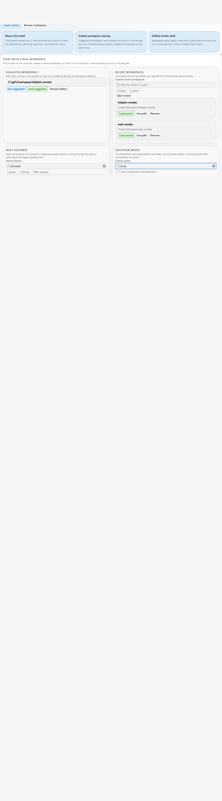
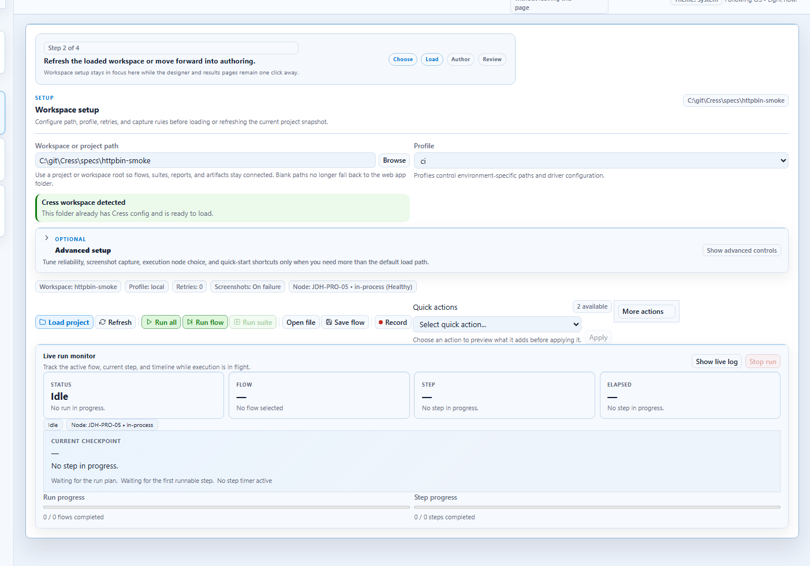

# Cress documentation

Cress is a workflow-first end-to-end testing platform for Windows teams that need **authoring tools**, **CLI automation**, **step manifests**, **living documentation**, and **evidence-rich execution** in one place.

> [!TIP]
> If you are new to Cress, start with [Getting started](getting-started/index.md) and use the [HTTP quickstart](getting-started/quickstart-http.md) for the fastest first run.

## What you can do with Cress

- initialize a project with opinionated folders, profiles, and starter assets
- author flows through Studio, Studio Web, or source-first YAML editing
- record browser and desktop steps, then normalize them into durable locators
- run flows locally or in CI with profiles, reports, screenshots, and diagnostics
- export framework-native xUnit, NUnit, and MSTest tests that still execute through the Cress engine
- publish living docs and generated API reference from the same repository

## Product surfaces

| Surface | Best for | Start here |
| --- | --- | --- |
| **CLI** | bootstrapping projects, validation, running flows, reports, diagnostics | [CLI reference](api/cli-reference.md) |
| **Studio / Studio Web** | recording, editing, reviewing evidence, watching metrics | [Studio overview](user-guide/studio-overview.md) |
| **Specs and manifests** | source-controlled capabilities, flows, fixtures, and steps | [Project schema guide](api/project-schema.md) |
| **Generated API reference** | browsing public .NET types and namespaces | [API reference](reference/api/index.md) |

## Guided paths

### New users

1. [Install prerequisites and choose a quickstart](getting-started/index.md)
2. [Run the HTTP sample](getting-started/quickstart-http.md)
3. [Walk through Studio](user-guide/studio-overview.md)
4. [Run and debug flows](user-guide/running-and-debugging.md)

### Web automation teams

1. [Create a project and set a web profile](getting-started/quickstart-web.md)
2. [Use the recording flow](user-guide/recording-workflows.md)
3. [Normalize locators and flow YAML](user-guide/authoring-flows.md)

### Desktop automation teams

1. [Enable the FlaUI driver](getting-started/quickstart-desktop.md)
2. [Use the desktop recording target picker](user-guide/recording-workflows.md)
3. [Design desktop apps for automation](developer-guide/designing-for-automation.md)

### Contributors

1. [Understand the repository](developer-guide/repository-overview.md)
2. [Set up local development](developer-guide/local-development.md)
3. [Extend Cress with steps, plugins, and import/export paths](developer-guide/extensibility.md)
4. [Build and publish the docs site](developer-guide/docs-and-ci.md)

## Common testing targets

| Target | Primary approach | Guide |
| --- | --- | --- |
| CLI tools | plugin-backed steps and process assertions | [Testing CLI apps](user-guide/testing-cli-apps.md) |
| Services and APIs | built-in HTTP driver plus JSON assertions | [Testing services](user-guide/testing-services.md) |
| Web apps | Playwright-backed browser flows with Studio recording | [Testing web apps](user-guide/testing-web-apps.md) |
| Desktop apps | FlaUI-backed Windows flows with Studio authoring | [Testing desktop apps](user-guide/testing-desktop-apps.md) |

## Native test framework integration

Cress can now generate framework-native tests for teams that want Cress-authored flows to live inside existing .NET test projects and CI suites:

- [xUnit, NUnit, and MSTest integration guide](developer-guide/test-framework-integrations.md)
- [Framework demos and development-cycle integration](developer-guide/test-framework-demos.md)
- [Environment orchestration](developer-guide/environment-orchestration.md)

## Studio at a glance

The existing product screenshots are included throughout the guides so teams can follow the same screens they see in the app.

## Documentation map

- [Getting started](getting-started/index.md)
- [User guide](user-guide/index.md)
- [Developer guide](developer-guide/index.md)
- [API guide](api/index.md)
- [Generated API reference](reference/api/index.md)
