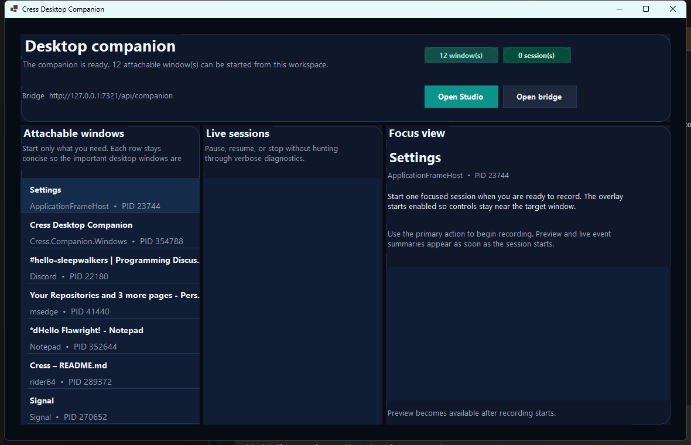
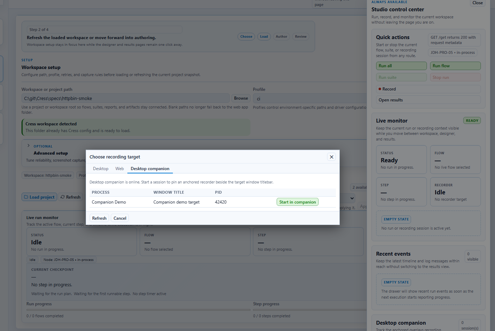
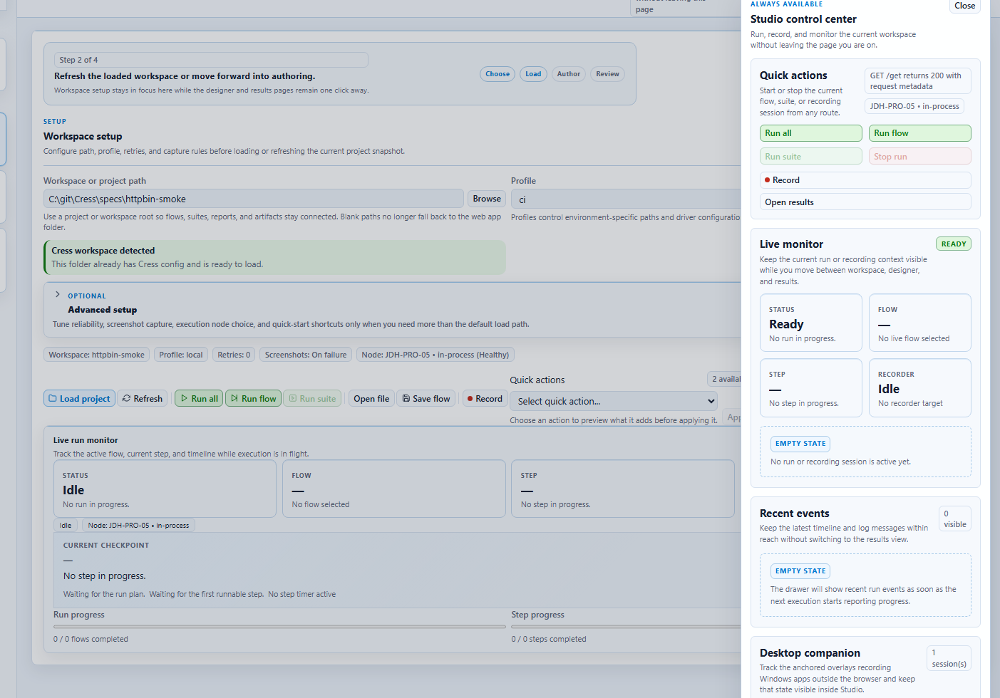

# Desktop companion

The desktop companion is the Windows-side control surface for **anchored desktop recording**. It runs beside Studio Web instead of replacing it: the companion stays close to the app you are recording, while Studio keeps authoring, results, and diagnostics in the browser.

## What it is for

Use the desktop companion when you need to:

1. attach to one or more Windows apps without leaving the desktop
2. keep a small overlay anchored near the target window titlebar while you record
3. pause, resume, or stop desktop sessions from a taskbar-visible manager
4. surface those same sessions back inside Studio Web

## Requirements

- Windows
- .NET SDK `10.0.107` or later
- the main Cress restore/build prerequisites from the repo root `README.md`

## Install and launch

1. Restore and build the repo.
2. Start Studio Web or the Aspire AppHost if you want the browser pairing workflow.
3. Launch the companion:

```powershell
dotnet run --project src\Cress.Companion.Windows\Cress.Companion.Windows.csproj --configuration Release
```

The companion starts three things together:

- a **manager window** for multi-app control
- a **tray/taskbar presence** so it stays reachable even when hidden
- a **local bridge** on `http://127.0.0.1:7321` that Studio Web can query



## Pair it with Studio Web

1. Start the companion.
2. Open Studio Web.
3. Open the recording workflow.
4. Switch to **Desktop companion**.
5. Start a session from one of the attachable windows reported by the companion.

When the bridge is reachable, Studio shows companion targets and live sessions directly in the picker.



## Record a desktop app step by step

1. Launch the Windows app you want to capture.
2. Start the desktop companion.
3. In the manager, confirm the app appears under **Attachable windows**.
4. Start the session from Studio Web or the companion manager.
5. Interact with the target app.
6. Use the companion overlay or manager to pause, resume, or stop the session.
7. Return to Studio Web to review the inferred steps and save the resulting flow.

The refreshed manager keeps the current target or session in a dedicated **Focus view** so the latest preview, actions, and bridge details stay readable without flooding the rest of the window with dense diagnostic text.

## Use the control center for cross-route monitoring

Once the companion is paired, Studio Web keeps the current companion status visible in the always-available control center. That gives you a browser-side summary even while the native companion stays attached to the desktop app.



## Features at a glance

| Feature | What it gives you |
| --- | --- |
| Multi-app session manager | Track more than one attached desktop session from one place |
| Anchored overlay widgets | Keep lightweight controls near the target window instead of switching back to Studio |
| Local HTTP bridge | Lets Studio Web discover targets and monitor sessions without embedding desktop code into the browser shell |
| Pause / resume / stop | Control live desktop sessions from the manager, overlay, or Studio picker |
| Studio-aware monitoring | Mirror companion state in the Studio recording picker and control center |

## Troubleshooting

### Studio says the companion is unavailable

Make sure the Windows companion is running and that `http://127.0.0.1:7321/health` responds locally.

### The target app does not appear in the companion list

The companion only lists processes with a visible main window. Launch the app fully first, then refresh the target list.

### A target is listed but not attachable

That usually means Windows denied access to the process metadata. Start Studio and the companion with the same elevation level as the target app.
