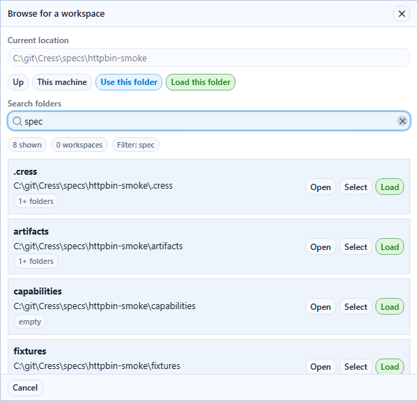
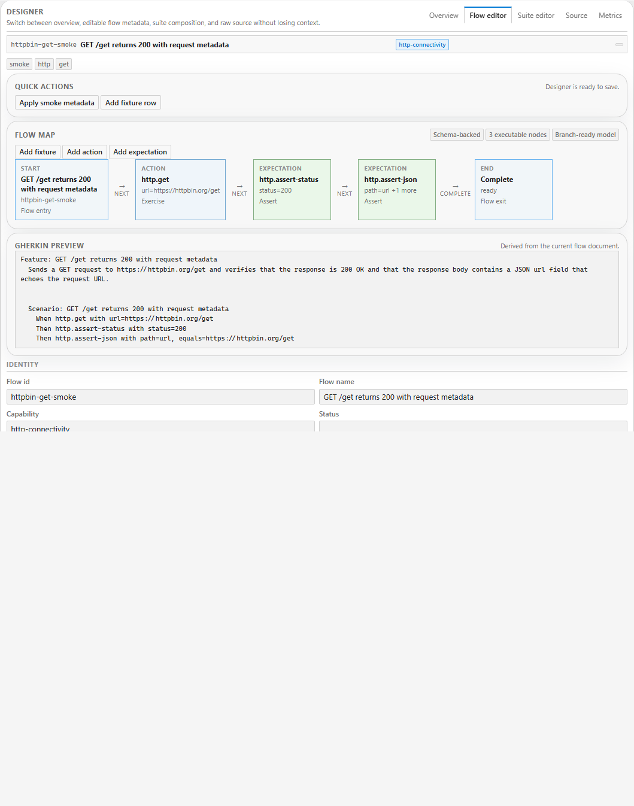
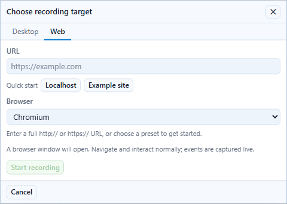
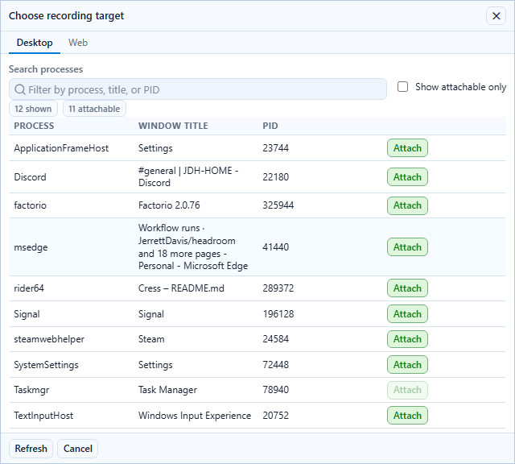
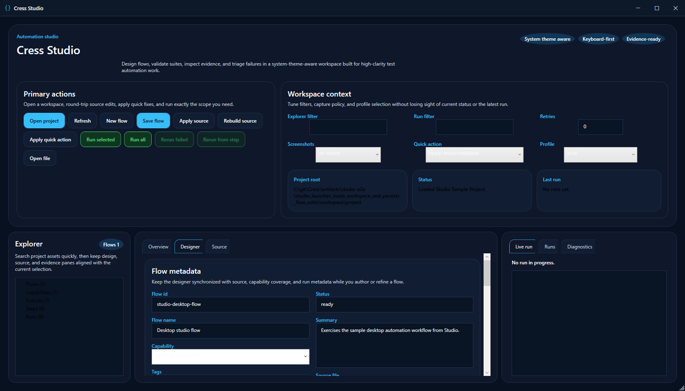
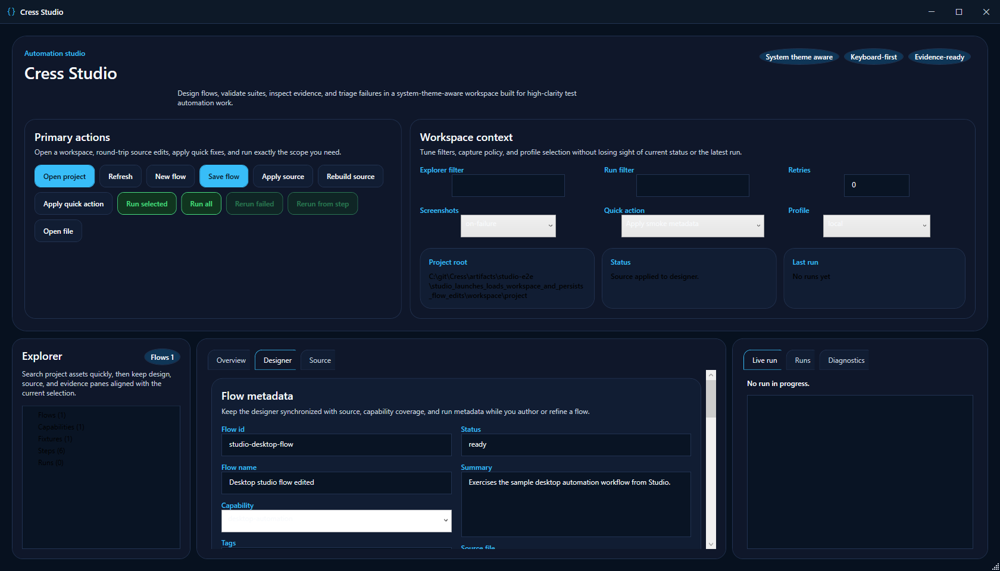
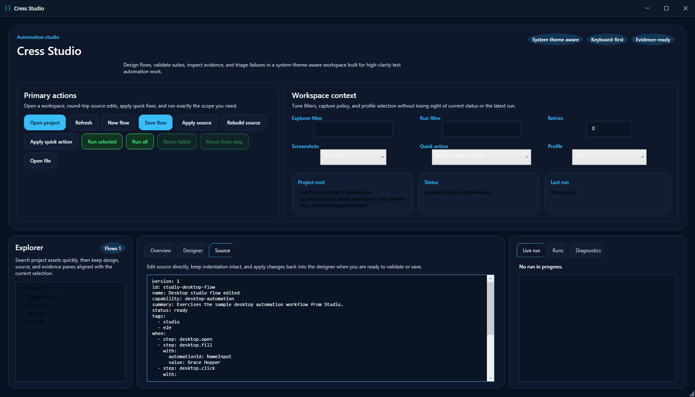
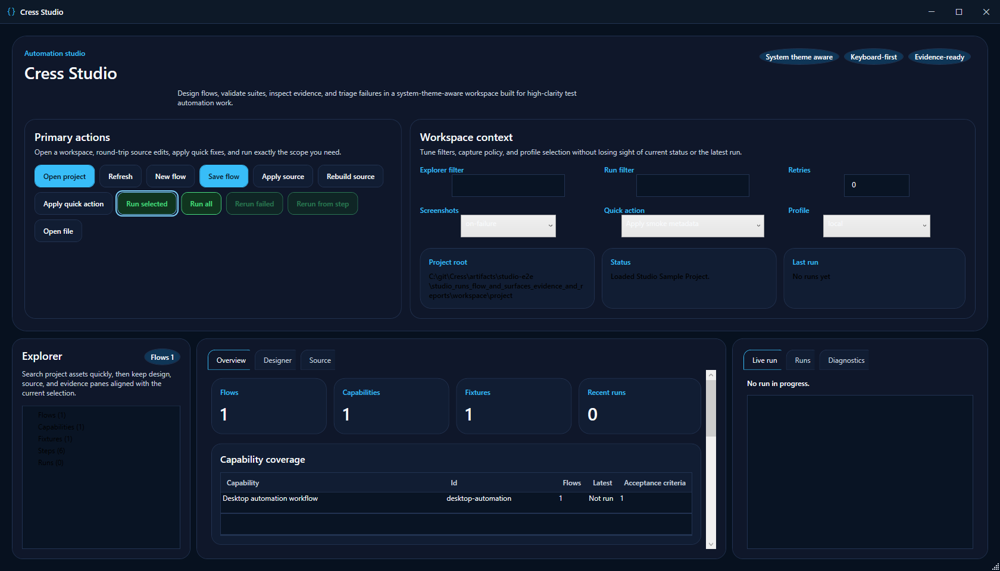
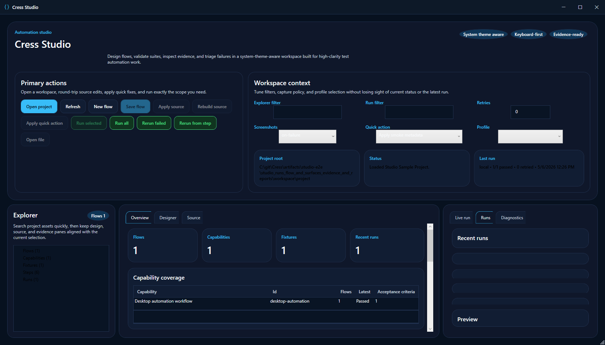

# Feature map

This page is the screenshot-backed **feature map and release matrix** for the current Cress product surface.

It tracks the **user-visible Cress features** and points to the screenshots and guides that document them.

> [!IMPORTANT]
> Treat this page as a release-facing inventory. **Every feature change should update this matrix** and, when the UI changes materially, refresh or add the matching screenshot under `docs\images\`.

## Studio and Studio Web feature map

| Area | Feature | What it enables | Screenshot | Guide |
| --- | --- | --- | --- | --- |
| Onboarding | Landing page and workspace startup | Start from the web-first landing surface with suggested folders, recent workspaces, and a focused default layout that only expands the heavier demo and node panels when you ask for them. |  | [Studio overview](studio-overview.md) |
| Onboarding | Built-in demo, recent-history, and node discovery | Expand the optional setup panels when you need them to filter demos, manage recent workspaces in-place, or scan runner readiness before you commit to a workspace path. |  | [Studio overview](studio-overview.md) |
| Workspace loading | Loaded project shell | Shows the loaded workspace with clearer setup, explorer, designer, and results framing, a one-glance setup summary, stronger empty-state treatments when panels are waiting for input, path readiness feedback, the scan-friendly status bar, the explicit theme readout, and the main authoring and execution tabs. |  | [Studio overview](studio-overview.md) |
| Workspace loading | Workspace picker | Browse the machine, filter folders, and select or load a workspace from the in-app picker instead of typing long paths from memory. |  | [Studio overview](studio-overview.md) |
| Authoring | Flow designer | Edit fixtures, actions, expectations, and visual flow structure from the main designer surface, with grouped quick actions that preview what each authoring shortcut adds before applying it. |  | [Authoring flows](authoring-flows.md) |
| Authoring | Source editor | Normalize generated flows into durable YAML with capabilities, tags, and stable locators. |  | [Studio overview](studio-overview.md) |
| Recording | Web recording picker | Capture browser flows and then save/replay the inferred steps back into the workspace, with visible URL validation and quick-start presets for common targets. |  | [Recording workflows](recording-workflows.md) |
| Recording | Desktop recording picker | Attach to a Windows app and capture desktop interactions into a reusable flow, with process search and an attachable-only view for faster target selection. |  | [Recording workflows](recording-workflows.md) |
| Execution review | Results panel | Review screenshots, traces, reports, step outcomes, and rerun-focused evidence after execution, with run filtering, failed-only triage, and artifact type filters to find the right evidence faster. |  | [Running and debugging](running-and-debugging.md) |
| Health and quality | Metrics tab | Inspect flakiness, repeated failures, and capability-level coverage trends with an explicit heatmap legend plus filtered run insights for faster flake triage. |  | [Studio overview](studio-overview.md) |

## Legacy desktop Studio screenshot matrix

These screenshots are still part of the repository documentation set and should be kept aligned anywhere the legacy desktop shell is referenced.

| Area | Feature | What it enables | Screenshot | Guide |
| --- | --- | --- | --- | --- |
| Explorer and selection | Flow selection | Select a flow and inspect the currently loaded authoring context in the desktop shell. |  | [Studio overview](studio-overview.md) |
| Authoring | Designer surface | Edit and refine the visual designer state in the desktop shell. |  | [Authoring flows](authoring-flows.md) |
| Authoring | Source editing | Make durable YAML edits directly from the desktop source editor. |  | [Authoring flows](authoring-flows.md) |
| Execution review | Run completed state | Confirm the desktop shell has completed the run and returned evidence-rich status. |  | [Running and debugging](running-and-debugging.md) |
| Execution review | Report preview | Preview generated reports inside the desktop shell after execution. |  | [Running and debugging](running-and-debugging.md) |

## Non-visual product surfaces

These features do not have a primary screenshot-driven surface, but they still belong in the product inventory and should be kept current here.

| Surface | Feature | What it enables | Guide |
| --- | --- | --- | --- |
| CLI | Project bootstrap, validation, execution, reporting, and docs generation | Use `cress` in local dev and CI for setup, validation, run orchestration, diagnostics, and report generation. | [CLI reference](../api/cli-reference.md) |
| HTTP driver | Service and API automation | Run service smoke flows with request/response assertions and evidence capture. | [Testing services](testing-services.md) |
| Playwright-backed web automation | Browser automation | Execute browser flows with durable locators, screenshots, and mixed UI/API assertions. | [Testing web apps](testing-web-apps.md) |
| Flawright-backed desktop automation | Windows desktop automation | Launch or attach to desktop apps and capture screenshot-heavy evidence for desktop flows. | [Testing desktop apps](testing-desktop-apps.md) |
| Living docs | Executable documentation output | Publish HTML living docs and evidence-backed summaries from real runs. | [Running and debugging](running-and-debugging.md) |
| Native test generation | xUnit, NUnit, and MSTest output | Generate framework-native C# tests that still execute through the Cress engine. | [Framework integrations](../developer-guide/test-framework-integrations.md) |

## Maintenance rule for new features

When a feature is added, removed, renamed, or materially reshaped:

1. update or add the row on this page
2. update the linked user/developer guide
3. refresh the screenshot asset if the UI changed
4. keep the screenshot filename stable unless the screen itself has been replaced

For screenshot refresh workflow details, see [Docs and CI](../developer-guide/docs-and-ci.md).
