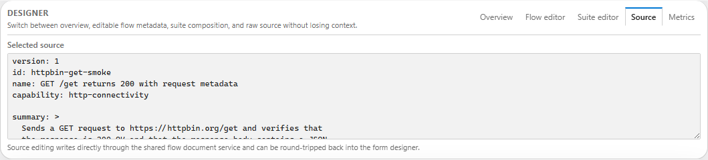
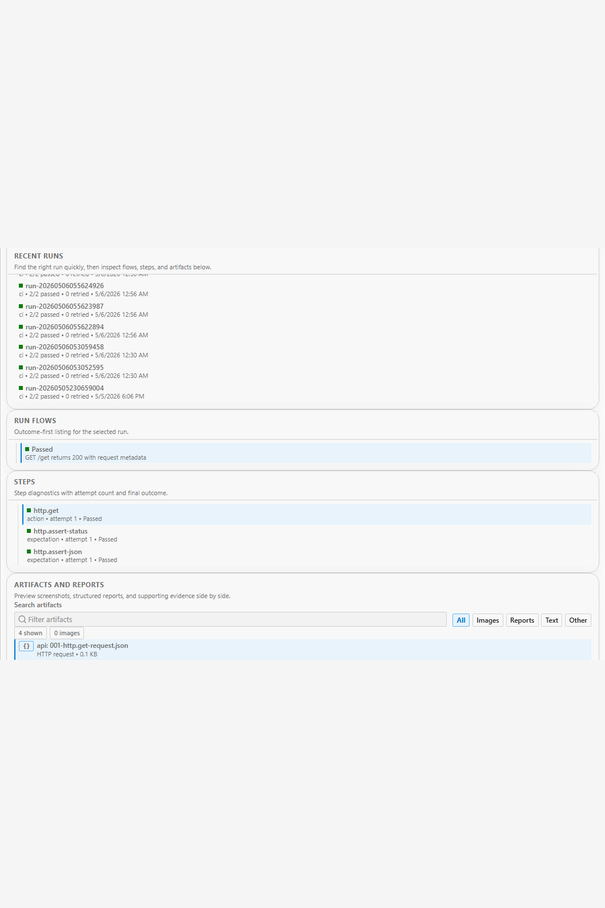
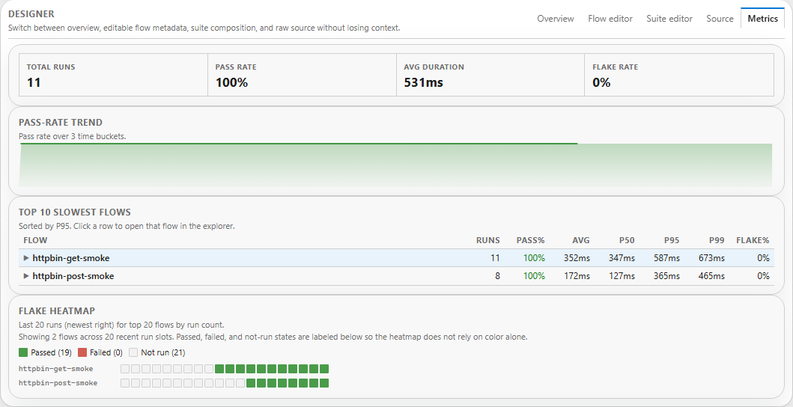

# Studio overview

Studio and Studio Web are the fastest way to understand the workspace because they put the project explorer, flow editor, evidence panels, and metrics in one place.

## Launch the environment

You can use Studio in three main ways:

1. **Aspire AppHost** while developing the full repo
2. **installed or portable Studio bundle** when you want the production-ready Windows shell
3. **`cress-studio` dotnet tool** when you want a local Windows tool install without unpacking the portable zip yourself

```powershell
dotnet run --project src\Cress.AppHost\Cress.AppHost.csproj --configuration Release --launch-profile http
```

For the production-ready Windows bundle:

```powershell
powershell -ExecutionPolicy Bypass -File scripts\Publish-StudioInstaller.ps1 -Version 0.1.0-local
```

That packaging flow gives you:

- `Cress.Studio.Setup-<version>.msi` with Start Menu entries for **Cress Studio** and **Cress Studio (Browser)**
- `Cress.Studio-win-x64-<version>.zip` with `Launch Cress Studio Desktop.cmd` and `Launch Cress Studio Browser.cmd`
- `Cress.Studio.Tool.<version>.nupkg` for the Windows `cress-studio` tool

For the tool path after packing or downloading the package:

```powershell
dotnet tool install --tool-path .\.tools\studio --prerelease --add-source artifacts\packages Cress.Studio.Tool
.\.tools\studio\cress-studio --desktop
```

## 1. Start at the landing page

The landing page is the orientation point for new users.

Use the Studio Web root route (`/`) when you want that landing experience. The dedicated `/workspace` route still jumps directly to workspace setup once you already know where you want to go.

It now gives you one place to:

- stay focused on the essential workspace steps by default and expand the optional panels only when you need them
- start from a compact workspace-first header instead of a large marketing-style landing slab
- choose a startup path from a straight wizard: **New**, **Open**, or **Samples / demos**
- follow a clearer step-by-step progression that keeps workspace choice and loading in the foreground first
- keep suggested and recent projects integrated into the **Open** path instead of splitting them into separate startup panes
- start from built-in demo workspaces only when you switch into the **Samples / demos** path
- search and prune recent workspace history without leaving the page
- filter the demo list before loading a project
- leave execution-node choice in the later advanced setup surface instead of exposing it in the first startup step
- keep authoring and results surfaces dimmed as previews until the workspace is actually loaded
- use the left sidebar as real page navigation once the workspace is loaded, instead of scrolling one long shell
- keep retry, screenshot, node, and quick-start controls tucked into an advanced setup disclosure until you need them


## 2. Load a project

Once loaded, the project view gives you the explorer, selected flow context, and the main authoring surfaces.

The setup surface now carries the main workflow emphasis, and the heavier authoring and evidence panels expand only after the workspace is ready instead of competing for attention on first load.

After load, the main routes now behave like focused pages:

- `/workspace` keeps you on setup and loading
- `/designer` shows the explorer plus authoring surfaces
- `/results` isolates execution review, diagnostics, and comparison

The packaged Studio bundle uses the same Blazor shell for both Windows launch styles:

- the **desktop shell** wraps the Studio URL in an embedded WebView2 window
- the **browser host** keeps the local Studio service running while your default browser owns the main tab experience


At this stage you can:

- browse capabilities, flows, fixtures, and run history
- confirm the active path, profile, retry, screenshot, and node settings from one summary strip
- see immediately whether the chosen path already looks like a real Cress workspace before reloading
- scan the setup, explorer, designer, and results surfaces as clearly separated regions instead of one flat shell
- get stronger empty-state callouts whenever a panel is waiting for a selection, a run, or matching data
- use the status bar and theme controls without leaving the shell
- pair with the optional desktop companion to launch titlebar-adjacent recording overlays and keep active desktop sessions visible in the recording picker and control center
- switch between designer, source, results, and metrics
- confirm that the project structure loaded correctly

If you need to browse to a different folder first, use the in-app workspace picker and its built-in folder filter rather than leaving the shell.

## 3. Record with the desktop companion when you need multi-app desktop capture

The Windows-only desktop companion is optional, but it is the best fit when you need a recording surface that stays visually attached to desktop apps while you move between Studio routes.

Start it with:

```powershell
dotnet run --project src\Cress.Companion.Windows\Cress.Companion.Windows.csproj --configuration Release
```

Once running, Studio Web can discover it from the recording picker and the control center. Use it to:

- attach to multiple desktop apps from one manager window
- keep a small anchored overlay near the target window titlebar instead of switching back to Studio for every control
- pause, resume, and stop live desktop sessions while still seeing the latest inferred step text in Studio Web
- expose a local bridge that lets Studio track those sessions without replacing the main Blazor authoring experience

## 4. Use Source for durable edits

Recorded flows become maintainable when you normalize them in the source editor.



Typical edits:

- replace fragile locators with stable contracts
- rename draft flows into business-facing names
- add tags, capabilities, and acceptance criteria links
- move environment-specific data into profiles and variables

## 5. Inspect evidence in Results

The results view is where authors answer the two most important questions: **what failed** and **why**.



Use it to review:

- screenshots
- generated HTML or JSON reports
- traces and run artifacts
- per-step outcomes

## 6. Watch health in Metrics

The metrics view helps teams shift from one-off runs to sustainable automation quality.



Use it to spot:

- repeated failures
- flaky flows
- capability coverage gaps
- candidates for cleanup or shared templates
